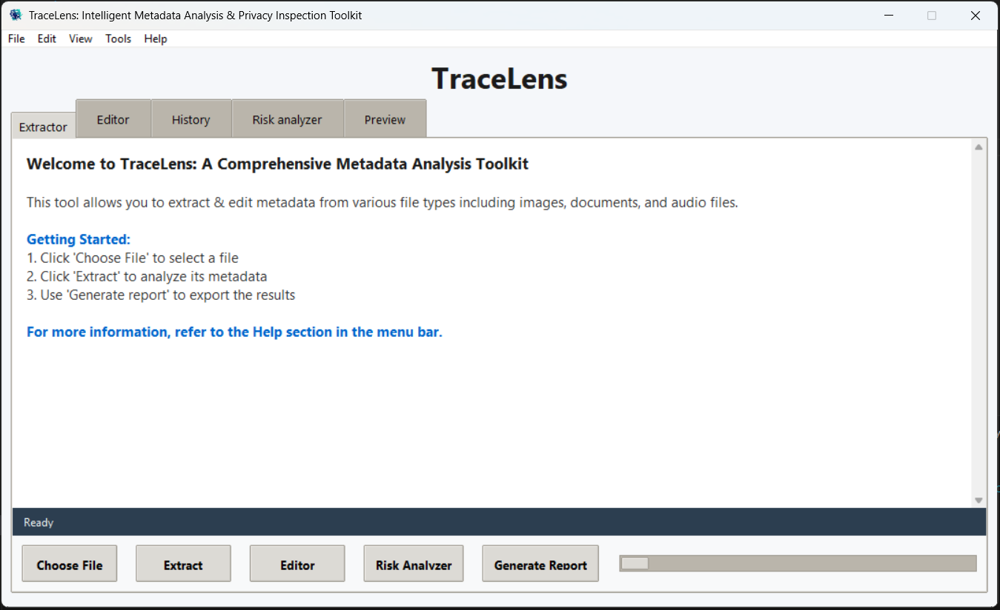

# TraceLens: Intelligent Metadata Analysis & Privacy Inspection Toolkit


**TraceLens** is a comprehensive desktop application for extracting, analyzing, editing, and managing file metadata with a focus on privacy and forensic risk assessment. Built with Python and Tkinter, it provides both a user-friendly GUI and a powerful command-line interface for professionals, forensic analysts, and privacy-conscious users.

## Table of Contents

- [Overview](#overview)
- [Key Features](#key-features)
- [Screenshots](#screenshots)
- [Feature Breakdown](#feature-breakdown)
- [Supported File Types](#supported-file-types)
- [Project Structure](#project-structure)
- [Architecture](#architecture)
- [Technical Stack](#technical-stack)
- [Installation](#installation)
- [Usage](#usage)
  - [GUI Application](#gui-application)
  - [Command-Line Interface](#command-line-interface)
- [Configuration](#configuration)
- [Database Schema](#database-schema)
- [API Reference](#api-reference)
- [Testing](#testing)
- [Troubleshooting](#troubleshooting)
- [Known Limitations](#known-limitations)
- [License](#license)

## Overview

TraceLens empowers users to:
- **Extract** detailed metadata from 50+ file formats
- **Analyze** privacy risks and forensic implications using intelligent scoring
- **Edit** and manage metadata with granular field-level control
- **Generate** comprehensive reports in multiple formats (PDF, JSON, XML, CSV, Excel)
- **Track** extraction history with SQLite persistence
- **Visualize** metadata trends and risk patterns through interactive dashboards

Perfect for:
- Digital forensics professionals
- Privacy advocates and security researchers
- Data analysts and compliance teams
- System administrators and IT auditors

## Key Features

**Multi-Format Metadata Extraction**
- PDF files via PyPDF2
- Text documents with line count & encoding detection
- Images (JPEG, PNG, TIFF) with EXIF data
- Audio files (MP3, FLAC, M4A, WAV)
- Office documents (.docx, .xlsx, .pptx)
- 50+ additional formats via Hachoir parser

**Intelligent Risk Analysis**
- Rule-based privacy risk scorer (0-100 scale)
- Detects GPS coordinates, author identity, device info, editing traces
- Identifies hidden metadata blocks (XMP, EXIF, IPTC, MakerNote)
- Forensic timeline generation for extracted files
- Color-coded risk levels: LOW, MEDIUM, HIGH

**Metadata Editing & Management**
- Field-level editing control with validation
- Write metadata changes back to files
- Batch editing for multiple files
- Undo/redo functionality
- Version tracking per file

**Comprehensive Reporting**
- Export to PDF, JSON, XML, CSV, Excel
- Batch processing with aggregate summaries
- Formatted text reports with headers and sections
- Risk analysis included in all report formats
- Customizable report templates

**SQLite History & Persistence**
- Local database for extraction history
- Search and filter extracted records
- Sort by any field
- Bulk export extraction history
- Data deletion with confirmation
- Time-range filtering

**Interactive Dashboard**
- Statistics with charts and graphs
- Metadata trend analysis
- Risk distribution visualization
- File type breakdown
- Extraction timeline

**Dual Interface**
- **GUI**: Full-featured Tkinter desktop application
- **CLI**: Menu-driven terminal interface 

## Screenshots

### Application Interface
Main Application Window


### GUI Features

#### Extractor Tab


#### Editor Tab


#### Risk Analyzer Tab

Note: *If file isn't modified only creation date is shown in timeline.*

#### Preview/Reports Tab

Note: *Poppler needs to be installed in windows to see preview*

#### History Tab

Note: *Previous files metadata can be also fetched directly from database using history tab.*

#### Dashboard


### CLI Interface


## Feature Breakdown

### 1) Metadata Extraction

Extract comprehensive metadata from diverse file types:
- Choose a file from the Extractor tab and click "Extract Metadata"
- Format-aware extraction strategy:
  - **PDF files**: Title, Author, Subject, Creator, Keywords, Pages, Creation Date, Modification Date
  - **Text files**: File size, line count, encoding, character count
  - **Image files**: EXIF data (camera model, GPS, date taken, dimensions)
  - **Audio files**: Title, artist, album, duration, bitrate, codec
  - **Document files**: Author, subject, title, revision count, last modified by
  - **Other formats**: Hachoir parser extracts available metadata blocks
- Results displayed in organized table format
- Automatic database persistence with timestamps
- Export metadata for external processing

### 2) Metadata Editing & Write-Back

Modify extracted metadata with granular control:
- Editable metadata fields displayed in the Editor tab
- Non-editable core fields preserved: `File Name`, `File Size`, `File Type`, `Extracted At`, `Modified On`
- Write-back support for multiple formats:
  - **PDF**: Document properties via PyPDF2
  - **Images**: EXIF/IPTC via piexif (JPEG, TIFF), PNG text chunks
  - **Audio**: ID3 tags via mutagen (MP3, FLAC, M4A, OGG, WAV)
  - **Office**: Core properties via python-docx (.docx) and openpyxl (.xlsx)
  - **Text**: Metadata header injection (JSON, YAML, comments)
  - **Fallback**: Companion `.meta.json` for unsupported formats
- Batch editing for multiple files
- Undo/redo functionality with change tracking
- Validation before write operations

### 3) History Management & Database

Comprehensive extraction history with powerful search and filtering:
- Every extraction saved to SQLite database (`file_metadata.db`)
- **Search & Filter Capabilities**:
  - Full-text search across metadata fields
  - File type filtering (PDF, images, audio, documents, etc.)
  - Date range filtering (last 24h, 7 days, 30 days, custom)
  - Sort by any column (file name, size, extraction date, risk level)
  - Multi-field search with AND/OR logic
- **Data Management**:
  - View any historical record in the application
  - Delete individual records with confirmation
  - Bulk delete with safety confirmations
  - Clear entire history (with backup opportunity)
  - Automatic timestamp tracking
- **Export Options**:
  - CSV for spreadsheet analysis
  - Excel for advanced data manipulation
  - JSON for API integration
  - XML for data interchange
  - PDF for formal reports
- History preservation across application sessions
- Automatic cleanup policies (optional archival)

### 4) Privacy & Forensic Risk Analysis

Intelligent risk scoring with actionable insights:
- **Risk Scoring Engine**:
  - 0-100 point scale: LOW (0-29), MEDIUM (30-64), HIGH (65-100)
  - Rule-based detection system (extensible)
  - Weighted scoring by risk category
  
- **Detection Rules**:
  - **GPS/Location Data**: Precise geo-coordinates in EXIF or metadata (30 pts)
  - **Author Identity**: Author, creator, owner, user information (18 pts)
  - **Device Information**: Camera model, serial numbers, device identifiers (18 pts)
  - **Editing Traces**: Software, application, editor, version history (15 pts)
  - **Hidden Metadata**: XMP, IPTC, EXIF, MakerNote blocks, thumbnails (20 pts)
  
- **Risk Output**:
  - Numerical risk score with reasoning
  - Color-coded severity indicators
  - Specific metadata fields triggering rules
  - Timeline extraction showing dates and locations
  - Anomaly detection (unexpected metadata presence)
  
- **Batch Analysis**:
  - Analyze multiple files simultaneously
  - Aggregate risk summary by level
  - Folder-level grouping and statistics
  - Comparative risk analysis
  - Timeline consolidation across files
  
- **Use Cases**:
  - Privacy audit before document sharing
  - Forensic timeline reconstruction
  - Data sanitization verification
  - Compliance checking

### 5) Reports & Export Functionality

Generate comprehensive reports in multiple formats:
- **Report Types**:
  - **PDF Reports**: Professional formatted documents with header/footer, tables, pagination
  - **Text Reports**: Plain-text formatted with sections and metadata tables
  - **Data Exports**: Structured data in standard formats
  
- **Export Formats**:
  - **JSON**: Complete metadata with nested structures and arrays
  - **XML**: Hierarchical metadata with proper encoding
  - **CSV**: Tabular format optimized for spreadsheets
  - **Excel**: Multi-sheet workbooks with formatting
  - **PDF**: Professional visual reports with styling
  
- **Report Contents**:
  - File information (name, path, size, type)
  - Complete metadata extraction
  - Risk analysis summary (if available)
  - Batch processing summaries
  - Extraction timestamps and metadata completeness
  
- **Advanced Features**:
  - Multiple report layouts and templates
  - Batch report generation for folders
  - Risk summary aggregation in batch mode
  - Print support with preview
  - Email export capability
  - Custom header/footer options

### 6) Interactive Dashboard & Analytics

Comprehensive statistics and insights:
- **Dashboard Widgets**:
  - Summary cards (total files, avg metadata fields, extraction success rate)
  - Risk distribution pie chart
  - File type breakdown bar chart
  - Size distribution histogram
  - Extraction timeline (files over time)
  - Metadata completeness heatmap
  
- **Filtering Options**:
  - Date range selection
  - File type filter
  - Text search across results
  - Risk level filter
  - Source folder filter
  
- **Analytics Features**:
  - Metadata trends and patterns
  - Top 10 most common metadata fields
  - Largest files analyzed
  - Most recent extractions
  - Success/failure rate stats
  - Risk distribution by file type
  
- **Export Analytics**:
  - Save dashboard snapshot
  - Export statistics as CSV/Excel
  - Generate analytics reports
  - Share insights with stakeholders

## Supported File Types

### Extraction Support

**Document Formats**:
- PDF (`.pdf`) - Complete metadata support
- Microsoft Office (`.docx`, `.xlsx`, `.pptx`) - Core properties + custom properties
- OpenDocument (`.odt`, `.ods`, `.odp`) - Via Hachoir
- Pages, Numbers, Keynote (macOS) - Via Hachoir

**Image Formats**:
- JPEG (`.jpg`, `.jpeg`) - Full EXIF, IPTC, Makernote
- PNG (`.png`) - EXIF, color profile, ICC
- TIFF (`.tiff`, `.tif`) - GeoTIFF, EXIF, compression info
- GIF (`.gif`) - Animation frames, metadata blocks
- BMP (`.bmp`) - Color depth, resolution
- WebP (`.webp`) - EXIF, XMP
- SVG (`.svg`) - Document properties, layers
- PSD (`.psd`) - Photoshop layers, color info
- ICO (`.ico`) - Icon properties

**Audio Formats**:
- MP3 (`.mp3`) - ID3 tags (v1, v2.3, v2.4)
- FLAC (`.flac`) - Vorbis comments
- M4A/AAC (`.m4a`, `.aac`) - iTunes properties, atom metadata
- OGG Vorbis (`.ogg`, `.ogv`) - Vorbis comments
- WAV (`.wav`) - INFO tags, ID3
- WMA (`.wma`) - ASF metadata
- OPUS (`.opus`) - Opus comments

**Video Formats**:
- MP4/MOV (`.mp4`, `.mov`) - Atom metadata, duration, codec
- AVI (`.avi`) - RIFF properties, frame rate
- MKV (`.mkv`) - Matroska tags, chapters
- FLV (`.flv`) - OnMetaData tags
- WebM (`.webm`) - Duration, codec info
- MTS/M2TS (`.mts`, `.m2ts`) - Video properties

**Archive Formats**:
- ZIP (`.zip`) - File list, compression method
- RAR (`.rar`) - Archive metadata
- 7z (`.7z`) - Archive properties
- TAR (`.tar`) - Archive members
- GZIP (`.gz`, `.gzip`) - Compression metadata

**Text & Code**:
- UTF-8 Text (`.txt`) - Size, line count, encoding
- Python (`.py`) - Docstrings, module metadata
- JavaScript (`.js`) - Comments, structure
- Java (`.java`) - Class info
- C/C++ (`.c`, `.cpp`, `.h`) - Header info
- JSON (`.json`) - Structure, schema info
- XML (`.xml`) - Namespaces, encoding, schema
- YAML (`.yml`, `.yaml`) - Config structure
- CSV (`.csv`) - Column count, encoding
- Markdown (`.md`) - Headings, links, structure
- HTML/CSS (`.html`, `.css`) - Meta tags, stylesheets
- LaTeX (`.tex`) - Document class, packages

**50+ Additional Formats**:
- Hachoir parser automatically detects and analyzes 50+ additional formats
- Including MIDI, EXE, DLL, ELF, ISO, FLAC, DV, WMV, and more

### Write-Back Support

**Primary Support**:
- PDF files (document properties)
- JPEG images (EXIF via piexif)
- PNG images (text chunks)
- TIFF images (EXIF via piexif)
- MP3 audio (ID3 tags via mutagen)
- FLAC audio (Vorbis comments)
- M4A/AAC audio (iTunes properties)
- OGG audio (Vorbis comments)
- DOCX files (core properties)
- XLSX files (workbook properties)

**Text-based Write-Back**:
- Metadata header injection to text files
- JSON companion files (`.metadata.json`)
- YAML front matter support
- CSV metadata fields

**Fallback Mechanism**:
- Unsupported formats → companion `.meta.json` file
- Preserves original file integrity
- External metadata management

## Technical Stack

**Core Framework**:
- Python 3.10+ (type hints: `dict[str, Any]`, `X | None`)
- Tkinter - Cross-platform GUI framework included with Python

**Metadata Extraction**:
- PyPDF2 (3.0+) - PDF parsing and metadata extraction
- Hachoir (3.2+) - Universal metadata parser for 50+ formats
- piexif (1.1.3+) - Image EXIF metadata handling
- mutagen (1.47+) - Audio metadata (ID3, Vorbis, MP4)
- python-docx (1.1+) - Microsoft Word document access
- openpyxl (3.1+) - Excel workbook handling
- pdf2image (1.16+) - PDF rendering

**Data Processing**:
- pandas (2.0+) - Data analysis and statistical computing
- Pillow (10.0+) - Image processing
- matplotlib (3.7+) - Charts and visualizations

**Report Generation**:
- ReportLab (4.0+) - PDF creation and manipulation

**Development & Testing**:
- pytest (8.3+) - Testing framework
- Type hints and dataclasses for strong typing
- Mock objects for isolated unit tests

## Project Structure

```text
TraceLens/
├── src/                           # Source code directory
│   ├── main.py                    # Application entry point
│   ├── cli.py                     # Command-line interface 
│   ├── gui.py                     # Tkinter GUI implementation
│   ├── extractor.py               # Metadata extraction engine
│   ├── editor.py                  # Metadata editing 
│   ├── db.py                      # SQLite database wrapper
│   ├── report.py                  # Report generation
│   └── risk_analyzer.py           # Risk scoring engine
├── tests/                         # Test suite
│   ├── test_main.py               # Main module tests
│   ├── test_gui.py                # GUI tests
│   ├── test_extractor.py          # Extractor tests
│   ├── test_editor.py             # Editor tests
│   ├── test_db.py                 # Database tests
│   ├── test_report.py             # Report tests
│   └── test_risk_analyzer.py      # Risk analysis tests
├── requirements.txt               # Python dependencies
├── LICENSE                        # MIT license
└── README.md                      # This file
```

## Architecture

### System Design

The application follows a **layered architecture** with clear separation of concerns:

```
┌─────────────────────────────────────────────────────────────┐
│                      USER INTERFACE LAYER                   │
│  ┌───────────┐  ┌────────────┐  ┌────────────┐  ┌─────────┐ │
│  │ Extractor │  │   Editor   │  │  History   │  │Analytics│ │
│  │    Tab    │  │    Tab     │  │    Tab     │  │Dashboard│ │
│  └─────┬─────┘  └─────┬──────┘  └─────┬──────┘  └────┬────┘ │
│        │              │               │              │      │
└────────┼──────────────┼───────────────┼──────────────┼──────┘
         │              │               │              │
         ▼              ▼               ▼              ▼
┌─────────────────────────────────────────────────────────────┐
│                  CORE BUSINESS LOGIC LAYER                  │
│  ┌──────────────┐  ┌──────────────┐  ┌──────────────────┐   │
│  │  Extractor   │  │    Editor    │  │ Risk Analyzer    │   │
│  │ - Validate   │  │ - Parse      │  │ - Score rules    │   │
│  │ - Extract    │  │ - Validate   │  │ - Timeline gen   │   │
│  │ - Format     │  │ - Write-back │  │ - Anomaly detect │   │
│  └──────┬───────┘  └──────┬───────┘  └────────┬─────────┘   │
│         │                 │                   │             │
└─────────┼─────────────────┼───────────────────┼─────────────┘
          │                 │                   │
          ▼                 ▼                   ▼
┌─────────────────────────────────────────────────────────────┐
│                   DATA PERSISTENCE LAYER                    │
│  ┌──────────────┐  ┌──────────────┐  ┌──────────────────┐   │
│  │  SQLite DB   │  │   Reporter   │  │  File System     │   │
│  │ - Metadata   │  │ - PDF Gen    │  │ - .meta.json     │   │
│  │ - History    │  │ - Export     │  │ - Modified files │   │
│  │ - Timestamps │  │ - Formatting │  │ - Backups        │   │
│  └──────────────┘  └──────────────┘  └──────────────────┘   │
└─────────────────────────────────────────────────────────────┘
```

### Module Responsibilities

#### **main.py** - Application Entry Point
- Initializes the application
- Launches the GUI
- Handles startup errors and logging

#### **cli.py** - Command-Line Interface Layer
- Provides interactive, menu-driven terminal workflow
- Exposes extraction, history, reporting, and risk analysis actions without GUI
- Handles CLI input validation and user prompts
- Integrates with core modules (`extractor.py`, `db.py`, `report.py`, `risk_analyzer.py`)
- Supports automation-friendly usage in headless environments

#### **gui.py** - Presentation Layer
- Tkinter GUI implementation
- Tab-based interface management
- User input handling
- Result visualization
- Settings and preferences

#### **extractor.py** - Data Acquisition Layer
- File validation
- Format detection
- Metadata extraction algorithms
- Database persistence
- Optional backup creation

#### **editor.py** - Data Modification Layer
- Metadata parsing and validation
- Field-level editing
- Write-back logic
- Rollback/backup management
- Format-specific serialization

#### **db.py** - Data Access Layer
- SQLite connection management
- CRUD operations
- Query building
- Export adapters
- Data aggregation

#### **report.py** - Reporting Layer
- Report generation
- PDF creation via ReportLab
- Multiple export formats
- Print management
- Template rendering

#### **risk_analyzer.py** - Analysis Engine
- Rule-based risk scoring
- Privacy/forensic rule definitions
- Timeline extraction
- Anomaly detection
- Batch analysis support

### Data Flow

```
User Action → GUI Event → Core Logic → Data Store → Report → User
   ▲                                        │         Output
   │                                        │
   └────────── Feedback Display ◄───────────┘
```

### Design Patterns Used

- **MVC Pattern**: Separation of model (data), view (GUI), controller (business logic)
- **Factory Pattern**: File type detection and handler selection
- **Strategy Pattern**: Different extraction/write strategies per format
- **Observer Pattern**: GUI state updates in response to data changes
- **Singleton Pattern**: Database and analyzer instances
- **Type Hints**: Full Python 3.10+ type annotation coverage

## Installation

### Prerequisites

- **Python 3.10 or later** (required for modern type syntax)
  - Check your version: `python --version`
  - Modern type hints like `dict[str, Any]` and `X | None` require Python 3.10+
- **Tkinter** (usually included with Python)
  - Windows: Included by default
  - macOS: `brew install python-tk@3.x`
  - Linux: `sudo apt-get install python3-tk`
- **Virtual Environment** (recommended)

### Step-by-Step Setup

#### 1. Clone the Repository

```bash
git clone https://github.com/Tanmay-Bhatnagar22/TraceLens.git
cd TraceLens
```

#### 2. Create Virtual Environment

```bash
# Windows
python -m venv .venv

# macOS/Linux
python3 -m venv .venv
```

#### 3. Activate Virtual Environment

Windows (PowerShell):
```powershell
.venv\Scripts\Activate.ps1
```

Windows (Command Prompt):
```cmd
.venv\Scripts\activate.bat
```

macOS/Linux:
```bash
source .venv/bin/activate
```

#### 4. Install Core Dependencies

```bash
# Install core dependencies
pip install -r requirements.txt

# Or install individually
pip install PyPDF2>=3.0.0 Pillow>=10.0.0 pandas>=2.0.0 \
            reportlab>=4.0.0 hachoir>=3.2.0 pdf2image>=1.16.0 \
            pytest>=8.3.0 matplotlib>=3.7.0
```

#### 5. Install Optional Dependencies (Recommended)

For extended metadata support:

```bash
# Image EXIF metadata (JPEG, TIFF)
pip install piexif>=1.1.3

# Audio metadata (MP3, FLAC, M4A, etc.)
pip install mutagen>=1.47.0

# Microsoft Office files (.docx, .xlsx, .pptx)
pip install python-docx>=1.1.0 openpyxl>=3.1.0

# Or install all at once
pip install piexif mutagen python-docx openpyxl
```

#### 6. Verify Installation

```bash
# Check imports
python -c "import PyPDF2; import tkinter; print('Setup successful!')"
```

## Usage

### Running the Application

#### GUI Mode (Recommended)

```bash
# From the repository root
python src/main.py
```

The Tkinter interface will launch with the following tabs:
- **Extractor**: Select and analyze files
- **Editor**: Modify metadata
- **History**: Search and manage extractions
- **Risk Analyzer**: Privacy analysis
- **Preview**: Generate and view reports
- **Dashboard**: View statistics (via Tools menu)

#### CLI Mode

```bash
# From src directory
python cli.py
```

Navigate through the menu-driven interface:
```
╔════════════════════════════════════╗
║  TraceLens CLI Menu                ║
╠════════════════════════════════════╣
║ 1. Extract Metadata from File      ║
║ 2. View History                    ║
║ 3. Search History                  ║
║ 4. Generate Report                 ║
║ 5. Risk Analysis                   ║
║ 6. Batch Processing                ║
║ 0. Exit                            ║
╚════════════════════════════════════╝
```

### Basic Workflow

1. **Extract Metadata**
   - Open Extractor tab
   - Click "Browse" to select a file
   - Click "Extract Metadata"
   - View results in the metadata panel

2. **Edit Metadata** (Optional)
   - Switch to Editor tab
   - Modify editable fields
   - Click "Save Changes"
   - Optionally "Write Back" to file

3. **Analyze Risk**
   - Switch to Risk Analyzer tab
   - View risk score and reasoning
   - Check timeline and anomalies
   - For batch: select multiple files

4. **Generate Report**
   - Switch to Preview tab
   - Select export format (PDF, CSV, JSON, etc.)
   - Click "Export" to save file
   - Click "Print" for immediate printing

5. **Browse History**
   - Switch to History tab
   - Search by filename or metadata
   - Filter by date, file type, or risk level
   - Delete or export records

### Advanced Usage

#### Batch Processing

```
Menu → Batch Process → Select Folder
- Analyze all files in directory
- Generate aggregate report
- Export summary statistics
```

#### Custom Reports

```
Preview Tab → Export Options:
- Select format (PDF/CSV/JSON/XML/Excel)
- Choose specific fields to include
- Apply filters before export
```

#### Database Management

```
Tools → Database Operations:
- Backup database
- Export history to file
- Clear history (with confirmation)
- View database statistics
```

### Command-Line Examples

Extract metadata programmatically:
```python
from src.extractor import MetadataExtractor

extractor = MetadataExtractor()
metadata = extractor.extract_pdf_metadata("document.pdf")
print(metadata)
```

Perform risk analysis:
```python
from src.risk_analyzer import PrivacyForensicAnalyzer

analyzer = PrivacyForensicAnalyzer()
metadata = {"author": "John Doe", "gps": "37.7749° N, 122.4194° W"}
result = analyzer.analyze(metadata)
print(f"Risk Score: {result['score']}")
print(f"Risk Level: {result['level']}")
```

## Configuration

### Settings File

Settings are stored in application preferences:
```
Edit → Preferences → General
- Default export format
- Database location
- Batch processing options
- Display preferences
```

### Database Location

Default: `file_metadata.db` (in application directory)

To use custom location:
```python
from src.db import MetadataDatabase
db = MetadataDatabase(db_path="/custom/path/metadata.db")
```

### Logging

Enable debug logging:
```
Edit → Preferences → Debug → Enable Logging
```

Logs stored in: `./logs/traceLens.log`

## API Reference

### MetadataExtractor Class

```python
from src.extractor import MetadataExtractor
from src import db

extractor = MetadataExtractor(db_client=db.db_manager)

# Extract PDF metadata
metadata = extractor.extract_pdf_metadata("file.pdf")

# Extract text metadata
metadata = extractor.extract_text_metadata("file.txt")

# General extraction with format detection
metadata = extractor.extract_metadata("file.ext")

# Check if file is valid
is_valid, error_msg = extractor._validate_file_path("file.path")
```

### MetadataEditor Class

```python
from src.editor import MetadataEditor

editor = MetadataEditor()

# Parse metadata
parsed = editor.parse_metadata({"Author": "John", "Title": "Doc"})

# Validate fields
is_valid, errors = editor.validate_metadata(parsed)

# Write back to file
success = editor.write_metadata_to_file("file.pdf", modified_metadata)
```

### MetadataDatabase Class

```python
from src.db import MetadataDatabase

db = MetadataDatabase(db_path="file_metadata.db")

# Insert metadata
db.insert_metadata({
    "file_path": "/path/to/file",
    "file_name": "document.pdf",
    "file_type": "pdf",
    "full_metadata": json.dumps(metadata)
})

# Query history
records = db.get_all_metadata()

# Search metadata
results = db.search_metadata(search_term="author", file_type="pdf")

# Export data
df = db.get_metadata_as_dataframe()

# Delete record
db.delete_metadata(record_id)
```

### PrivacyForensicAnalyzer Class

```python
from src.risk_analyzer import PrivacyForensicAnalyzer

analyzer = PrivacyForensicAnalyzer()

# Analyze single file
result = analyzer.analyze(metadata)
# Returns: {
#     "score": 65,
#     "level": "HIGH",
#     "reasons": ["GPS data found", "Author identified"],
#     "timeline": [...],
#     "anomalies": [...]
# }

# Batch analysis
results = analyzer.analyze_batch(file_list)

# Get risk level
level = analyzer.get_risk_level(score)  # Returns "LOW", "MEDIUM", or "HIGH"
```

### MetadataReporter Class

```python
from src.report import MetadataReporter

reporter = MetadataReporter()

# Generate text report
text = reporter.generate_report_text(metadata, file_path)

# Generate PDF report
pdf_path = reporter.generate_pdf_report(
    metadata, 
    output_path="report.pdf",
    include_risk=True,
    risk_analysis=result
)

# Export to formats
reporter.export_to_json(metadata, "export.json")
reporter.export_to_csv(metadata_list, "export.csv")
reporter.export_to_excel(metadata_list, "export.xlsx")
reporter.export_to_xml(metadata, "export.xml")
```

### GUI Class

```python
from src.gui import MetadataAnalyzerApp

app = MetadataAnalyzerApp()
app.run()  # Starts the Tkinter main loop
```

reporter.export_to_json(metadata, "export.json")
reporter.export_to_csv(metadata_list, "export.csv")
reporter.export_to_excel(metadata_list, "export.xlsx")
reporter.export_to_xml(metadata, "export.xml")
```

### GUI Class

```python
from src.gui import MetadataAnalyzerApp

app = MetadataAnalyzerApp()
app.run()  # Starts the Tkinter main loop
```

## Database Schema

### Metadata Table

```sql
CREATE TABLE metadata (
    id INTEGER PRIMARY KEY AUTOINCREMENT,
    file_path TEXT NOT NULL,
    file_name TEXT NOT NULL,
    file_size_formatted TEXT,
    file_type TEXT,
    extracted_at TEXT NOT NULL,
    modified_on TEXT,
    full_metadata TEXT NOT NULL
);
```

### Column Specifications

| Column | Type | Description |
|--------|------|-------------|
| `id` | INTEGER | Auto-incrementing primary key |
| `file_path` | TEXT | Full path to source file |
| `file_name` | TEXT | Extracted filename |
| `file_size_formatted` | TEXT | Human-readable file size (e.g., "1.5 MB") |
| `file_type` | TEXT | File extension (e.g., "pdf", "jpg") |
| `extracted_at` | TEXT | ISO 8601 timestamp of extraction |
| `modified_on` | TEXT | Last modification time of source file |
| `full_metadata` | TEXT | Complete metadata as JSON string |

### JSON Metadata Format

The `full_metadata` column stores complete metadata as JSON:

```json
{
    "File Name": "document.pdf",
    "File Size (bytes)": 1024000,
    "File Type": "pdf",
    "Extracted At": "2024-03-24T10:30:00",
    "Pages": 50,
    "Author": "John Doe",
    "Title": "Important Report",
    "Subject": "Business Analysis",
    "Creator": "Microsoft Word",
    "Keywords": "report, analysis, 2024",
    "Created": "2024-01-15T09:00:00",
    "Modified": "2024-03-20T14:30:00"
}
```

### Database Location

- **Default**: `file_metadata.db` in the application root directory
- **Auto-created**: Database is created automatically on first run
- **Backup**: Use Tools → Database Operations → Backup Database

### Query Examples

```python
from src import db

# Get all records
all_records = db.db_manager.get_all_metadata()

# Search by term
results = db.db_manager.search_metadata(search_term="author")

# Filter by date range
from datetime import datetime, timedelta
recent = db.db_manager.get_metadata_by_date_range(
    start_date=datetime.now() - timedelta(days=7),
    end_date=datetime.now()
)

# Export as DataFrame
df = db.db_manager.get_metadata_as_dataframe()

# Count records
count = db.db_manager.count_metadata()
```

## Testing

### Running Tests

Run the full test suite:

```bash
# All tests
pytest tests/

# Verbose output
pytest tests/ -v

# With coverage report
pytest tests/ --cov=src --cov-report=html
```

### Running Individual Test Modules

```bash
# Extractor tests
pytest tests/test_extractor.py -v

# Database tests
pytest tests/test_db.py -v

# Editor tests
pytest tests/test_editor.py -v

# Report generation tests
pytest tests/test_report.py -v

# Risk analyzer tests
pytest tests/test_risk_analyzer.py -v

# GUI tests
pytest tests/test_gui.py -v

# CLI tests
pytest tests/test_cli.py -v

# Main entry point tests
pytest tests/test_main.py -v
```

### Testing Strategy

- **Unit Tests**: Test individual functions and classes in isolation
- **Integration Tests**: Test module interactions
- **Mock Objects**: GUI interactions and file I/O are mocked
- **Fixtures**: Predefined test data for consistent testing
- **Coverage**: Aim for >80% code coverage

### Example Test

```python
# tests/test_extractor.py
import pytest
from src.extractor import MetadataExtractor

class TestMetadataExtractor:
    def setup_method(self):
        self.extractor = MetadataExtractor()
    
    def test_validate_file_path_valid(self):
        is_valid, error = self.extractor._validate_file_path("README.md")
        assert is_valid is True
        assert error == ""
    
    def test_validate_file_path_missing(self):
        is_valid, error = self.extractor._validate_file_path("nonexistent.pdf")
        assert is_valid is False
        assert "not found" in error.lower()
```

## Troubleshooting

### Installation Issues

#### Tkinter not found
**Problem**: `ModuleNotFoundError: No module named 'tkinter'`

**Solution**:
- **Windows**: Tkinter should be included. Reinstall Python with "tcl/tk and IDLE" checked
- **macOS**: `brew install python-tk@3.11` (adjust version as needed)
- **Linux (Ubuntu/Debian)**: `sudo apt-get install python3-tk`
- **Linux (Fedora)**: `sudo dnf install python3-tkinter`

#### Virtual environment activation fails
**Problem**: Script cannot be loaded

**Solution** (Windows PowerShell):
```powershell
Set-ExecutionPolicy -ExecutionPolicy RemoteSigned -Scope CurrentUser
.venv\Scripts\Activate.ps1
```

### Runtime Issues

#### Optional metadata libraries missing
**Problem**: Import errors for `piexif`, `mutagen`, etc.

**Solution**:
```bash
# Install all optional dependencies
pip install piexif mutagen python-docx openpyxl
```

#### Database locked error
**Problem**: `sqlite3.OperationalError: database is locked`

**Solution**:
- Close other instances of the application
- Delete `.db-journal` files if present
- Ensure file permissions allow write access

#### Report generation fails
**Problem**: PDF export fails silently

**Solution**:
- Verify ReportLab is installed: `pip install reportlab>=4.0.0`
- Check disk space for temp files
- Ensure PDF export location has write permissions

#### Metadata write-back doesn't work
**Problem**: Changes not reflected in file

**Solution**:
- Verify optional libraries are installed
- Check file is not read-only: `chmod u+w file.pdf` (Linux/macOS)
- Ensure source file is a supported format
- Check application has write permissions

#### Icon not loading on startup
**Problem**: Application window lacks icon

**Solution**:
- Ensure `Metadata.png` exists in the assets directory
- Verify file path is accessible from code location
- Check file format is PNG

### Database Issues

#### Database corruption
**Problem**: Cannot open database after crash

**Solution**:
```bash
# Tools → Database Operations → Backup Database
# Or manually:
sqlite3 file_metadata.db ".backup backup.db"
sqlite3 .backup/file_metadata.db ".restore file_metadata.db"
```

#### Large database slowing down searches
**Problem**: History search is slow

**Solution**:
- Clear old entries: Tools → Database Operations → Clear History
- Export to archive: History → Export → Select date range
- Consider reducing retention period

## Known Limitations

### Current Limitations

1. **Database Naming Discrepancy**
   - Menu references `metadata.db` but application uses `file_metadata.db`
- Planned fix: Unified naming in next release

2. **Office Format Support**
   - Full XLSX/PPTX metadata write-back not yet implemented
   - Only DOCX has complete write-back support
- Workaround: Export via companion `.meta.json` file

3. **GUI Limitations**
   - Headless/CLI mode limited for batch operations
   - Print dialogs may fail in non-GUI environments
- Workaround: Use CLI mode for scripting

4. **Performance**
   - Large batches (>1000 files) may take several minutes
   - Database queries slow with deep history (>50K records)
- Workaround: Archive history periodically

5. **Format Support**
   - Some rare file formats may not extract completely
   - Encrypted PDFs have limited metadata support
- Workaround: Use Hachoir debug mode for detailed inspection

### Platform-Specific Notes

- **Windows**: No known issues; full support
- **macOS**: Tkinter may require manual installation; some audio formats require extra codecs
- **Linux**: Requires Tkinter package; some distributions may lack default fonts

## License

This project is licensed under the MIT License. See the [LICENSE](LICENSE) file for details.

### MIT License Summary

- **Allowed**: Commercial use, modification, distribution, private use
- **Forbidden**: Liability, warranty
- **Requirements**: License and copyright notice

---

## Support & Contact

- **Email**: tanmaybhatnagar760@gmail.com
- **Issues**: [GitHub Issues](https://github.com/Tanmay-Bhatnagar22/TraceLens/issues)
- **Discussions**: [GitHub Discussions](https://github.com/Tanmay-Bhatnagar22/TraceLens/discussions)

---
