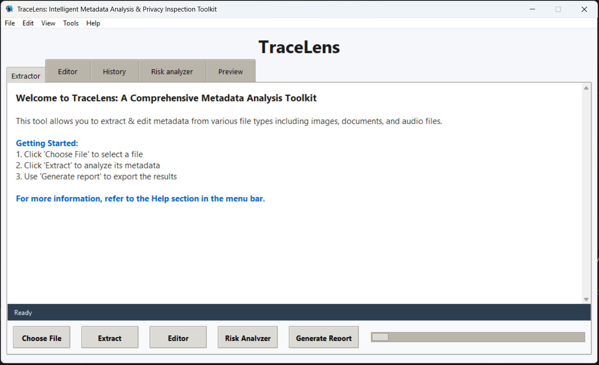

<div align="center">

# TraceLens: Intelligent Metadata Analysis & Privacy Inspection Toolkit

[](https://github.com/Tanmay-Bhatnagar22/TraceLens)
[](https://www.python.org/)
[](LICENSE)
[](https://github.com/Tanmay-Bhatnagar22/TraceLens)
[](tests/)
[](src/gui/)
[](src/cli/)
[](src/core/database/)

</div>

**TraceLens** is an advanced, enterprise-grade desktop and command-line application engineered for extracting, analyzing, editing, persisting, and reporting digital file metadata. Designed with a heavy emphasis on digital forensics, data governance, and privacy risk assessment, TraceLens provides investigators, compliance auditors, security researchers, and privacy-conscious users with deep visibility into hidden artifact structures across 50+ file formats.

---

## Table of Contents

- [Overview](#overview)
- [What is New in Version 2.0](#what-is-new-in-version-20)
- [Key Features](#key-features)
- [Interface & Screenshots](#interface--screenshots)
- [System Architecture](#system-architecture)
- [Project Structure](#project-structure)
- [Supported File Formats](#supported-file-formats)
- [Technical Stack](#technical-stack)
- [Installation & Setup](#installation--setup)
- [Usage Guide](#usage-guide)
  - [Graphical User Interface (GUI)](#graphical-user-interface-gui)
  - [Command-Line Interface (CLI)](#command-line-interface-cli)
  - [Batch Processing Workflow](#batch-processing-workflow)
- [Python API & Service Layer](#python-api--service-layer)
- [Risk Scoring & Forensic Engine](#risk-scoring--forensic-engine)
- [Database Schema & Persistence](#database-schema--persistence)
- [Future Roadmap & Version 3.0 Plan: TraceAi](#future-roadmap--version-30-plan-traceai)
- [Testing & Quality Assurance](#testing--quality-assurance)
- [Troubleshooting](#troubleshooting)
- [Known Limitations](#known-limitations)
- [Contributing](#contributing)
- [License & Contact](#license--contact)

---

## Overview

Modern digital files retain vast amounts of invisible metadata—ranging from precise GPS coordinates, device serial numbers, camera lens configurations, and user identifiers to detailed revision chains, internal network paths, and embedded thumbnails. Left uninspected, this metadata exposes severe privacy vulnerabilities, security leaks, and data governance risks.

TraceLens v2.0 delivers an end-to-end suite for forensic metadata management:
- **Extract**: Inspect and parse deep metadata trees across documents, images, audio, video, archives, and code files.
- **Analyze**: Evaluate privacy exposure and forensic anomalies with a configurable, YAML-driven risk engine.
- **Edit & Sanitize**: Modify, sanitize, or write back metadata directly into supported file containers.
- **Persist**: Automatically index extractions into an ACID-compliant SQLite database with fast full-text filtering.
- **Visualize**: Explore trends, risk distributions, and file metrics with interactive analytical dashboards.
- **Report**: Export publication-grade forensic dossiers in PDF, JSON, XML, CSV, Excel, and structured text formats.
- **Dual Interface**: Operate seamlessly via a responsive Tkinter GUI or a feature-complete Typer/Rich command-line suite.

---

## What is New in Version 2.0

Version 2.0 represents a major architectural evolution of TraceLens, transforming it from a utility script into a modular, production-ready forensic platform.

### 1. Unified Service Layer & Dependency Injection
- Introduced `ServiceContainer` as an application facade managing discrete lifecycle services: `ExtractionService`, `RiskAnalysisService`, `MetadataEditorService`, `HistoryService`, `ReportService`, and `AnalyticsService`.
- Clean separation between core domain algorithms, presentation layers (GUI/CLI), and persistence layers.

### 2. Configurable YAML-Based Risk & Forensic Rules Engine
- Replaced hardcoded heuristic checks with a decoupled rules engine (`rules.yaml`) loaded and validated through `yaml_parser.py` and `rule_models.py`.
- Granular scoring rules covering geolocation, personal identity, hardware fingerprints, software processing traces, hidden metadata containers, network paths, and digital signatures.
- Forensic anomaly detection algorithms:
  - **Timestamp Inversion Detection**: Flags chronological impossibilities (e.g., file modification preceding creation).
  - **Multiple Editing Chain Detection**: Detects distinct software signatures indicating tampering or multi-party revisions.
  - **Stacked Container Detection**: Identifies coexisting and potentially conflicting metadata blocks (XMP, IPTC, EXIF, MakerNotes).
- Context-specific remediation recommendations for every triggered rule.

### 3. Production CLI Overhaul (Typer + Rich)
- Modernized command-line subsystem with command groups (`extract`, `analyze`, `edit`, `report`, `history`, `export`, `logs`, `config`, `gui`).
- Interactive terminal outputs featuring rich colored tables, animated progress bars, live spinners, risk severity badges, and structured summary panels.
- Headless execution support suitable for CI/CD pipelines, forensic server nodes, and automated batch scripting.

### 4. Modular Tabbed GUI Architecture
- Refactored Tkinter presentation layer into dedicated, decoupled tab components (`ExtractorTab`, `EditorTab`, `RiskTab`, `PreviewTab`, `HistoryTab`).
- Added a dedicated `BatchProcessDialog` for multi-threaded folder scans and batch risk aggregation.
- Implemented `StatisticsDashboard` featuring embedded Matplotlib visual analytics, risk distribution breakdowns, format distributions, and extraction timelines.

### 5. Centralized Logging Infrastructure
- Integrated `logging_config.py` providing log rotation, thread-safe memory buffers for runtime diagnostics, configurable log levels via environment variables, and live GUI log viewer integration.

### 6. Expanded Format Parsing & Write-Back
- Deep integration of Hachoir alongside specialized engines (`PyPDF2`, `piexif`, `mutagen`, `python-docx`, `openpyxl`, `pdf2image`).
- Extended write-back support with safety backups and automatic companion `.meta.json` fallbacks for legacy/unsupported binary containers.

---

## Key Features

### Multi-Format Metadata Extraction
- Automated file format identification and parser dispatching.
- Extracts document properties, EXIF tags, GPS geo-tags, audio ID3/Vorbis tags, video stream metadata, archive tables, and source code statistics.
- Graceful fallbacks for unknown formats via universal binary stream parsing.

### Forensic Risk & Privacy Scoring
- 0 to 100 normalized risk score mapped into defined threat levels: LOW (0-29), MEDIUM (30-64), HIGH (65-100).
- Chronological timeline generation mapping creation, modification, capture, and edit events.
- Anomaly warnings and step-by-step remediation advice to sanitize files before distribution.

### Field-Level Editing & Sanitization
- Interactive editing interface with strict preservation of immutable file system properties (`File Name`, `File Size`, `File Type`, `Extracted At`, `Modified On`).
- In-place binary write-back for PDFs, JPEG/TIFF EXIF, PNG text chunks, MP3/FLAC/OGG/M4A tags, and Word/Excel documents.
- Automatic creation of `.bak` safety copies before performing destructive file modifications.

### SQLite History & Data Persistence
- Persistent local SQLite database (`file_metadata.db`) tracking extraction timestamps, formatted sizes, file paths, and raw JSON payloads.
- Multi-parameter search queries filtering by keyword, date ranges, risk thresholds, and file extensions.
- Database maintenance utilities including SQLite `VACUUM` optimization and batch purging.

### Multi-Format Reporting & Export
- Professional PDF reports rendered via ReportLab with headers, metadata key-value tables, risk summaries, timelines, and page numbering.
- Structured data export to JSON, XML, CSV, and Excel workbooks.
- Integrated document preview module leveraging `pdf2image` and Poppler.

### Analytical Dashboard
- Live visualization of historical metrics:
  - Risk distribution pie charts.
  - File format composition bar graphs.
  - File size distribution histograms.
  - Cumulative extraction activity timelines.

---

## Interface & Screenshots

### Main Application Window
The TraceLens desktop interface features an organized tab layout for intuitive workflow transitions.



### Tab Demonstrations

#### Extractor Tab
Browse, select, and parse files to view extracted metadata properties in an organized key-value grid.


#### Editor Tab
Modify editable metadata fields, validate field structures, and commit changes back to disk or the local database.


#### Risk Analyzer Tab
Inspect calculated risk levels, triggered privacy rules, forensic timeline events, and detected anomalies.


*Note: For unmodified files, the timeline reflects single-event creation records.*

#### Preview and Reports Tab
Preview PDF reports directly inside the application and export dossier packages across multiple formats.


*Note: PDF preview rendering requires Poppler binaries installed on the host system.*

#### History Tab
Search, sort, filter, and inspect previously analyzed files stored within the local SQLite database.


#### Analytics Dashboard
Examine aggregate metrics, file type breakdowns, and privacy risk trends across all historical scans.


### Command-Line Interface
The terminal interface provides structured tables, progress feedback, and full scriptability.


---

## System Architecture

TraceLens follows a strict layered architecture pattern, isolating presentation components from domain logic and infrastructure persistence.

```text
+-----------------------------------------------------------------------------+
|                            PRESENTATION LAYER                               |
|   +---------------------------------------+   +-------------------------+   |
|   |         Tkinter GUI Subsystem         |   |    Typer / Rich CLI     |   |
|   |  - ExtractorTab     - EditorTab       |   |  - extract   - analyze  |   |
|   |  - RiskTab          - PreviewTab      |   |  - edit      - report   |   |
|   |  - HistoryTab       - BatchDialog     |   |  - history   - export   |   |
|   |  - StatisticsDashboard                |   |  - logs      - config   |   |
|   +---------------------------------------+   +-------------------------+   |
+--------------------------------------|--------------------------------------+
                                       |
                                       v
+-----------------------------------------------------------------------------+
|                          SERVICE & APPLICATION FACADE                       |
|   +---------------------------------------------------------------------+   |
|   |                          ServiceContainer                           |   |
|   |  - ExtractionService  - RiskAnalysisService  - MetadataEditorService|   |
|   |  - HistoryService     - ReportService        - AnalyticsService     |   |
|   +---------------------------------------------------------------------+   |
+--------------------------------------|--------------------------------------+
                                       |
                                       v
+-----------------------------------------------------------------------------+
|                          CORE BUSINESS LOGIC LAYER                          |
|   +-------------------+  +-------------------+  +------------------------+  |
|   | MetadataExtractor |  |  MetadataEditor   |  | PrivacyForensicAnalyzer|  |
|   | - Format Detect   |  | - Field Parsing   |  | - YAML Rule Engine     |  |
|   | - PyPDF2/mutagen  |  | - In-place Write  |  | - Anomaly Detector     |  |
|   | - Hachoir Parser  |  | - Backup Handling |  | - Timeline Builder     |  |
|   +-------------------+  +-------------------+  +------------------------+  |
+--------------------------------------|--------------------------------------+
                                       |
                                       v
+-----------------------------------------------------------------------------+
|                         DATA & PERSISTENCE LAYER                            |
|   +-------------------+  +-------------------+  +------------------------+  |
|   | MetadataDatabase  |  | MetadataReporter  |  |      File System       |  |
|   | - SQLite Storage  |  | - ReportLab (PDF) |  | - Target Files        |  |
|   | - Query Filtering |  | - JSON / XML / CSV|  | - .meta.json Fallback  |  |
|   | - History CRUD    |  | - Excel Workbook  |  | - Rotated Logs (.log)  |  |
|   +-------------------+  +-------------------+  +------------------------+  |
+-----------------------------------------------------------------------------+
```

---

## Project Structure

```text
TraceLens/
|-- src/
|   |-- __init__.py
|   |-- main.py                     # Main GUI desktop entry point
|   |-- cli/                        # Command-line interface subsystem
|   |   |-- __init__.py
|   |   |-- cli.py                  # Typer commands, arguments, and handlers
|   |   |-- output.py               # Rich tables, panels, and spinners
|   |   `-- validation.py           # Path verification and input validation
|   |-- config/                     # Configuration and diagnostics
|   |   |-- __init__.py
|   |   `-- logging_config.py       # Rotating logger and in-memory log buffer
|   |-- core/                       # Core domain engines
|   |   |-- __init__.py
|   |   |-- database/               # SQLite database access
|   |   |   |-- __init__.py
|   |   |   `-- db.py               # Database manager and schema management
|   |   |-- editor/                 # Metadata modification and serialization
|   |   |   |-- __init__.py
|   |   |   `-- editor.py           # In-place write-back engine
|   |   |-- extractor/              # Parsing and extraction engine
|   |   |   |-- __init__.py
|   |   |   `-- extractor.py        # 50+ format parsers
|   |   |-- reports/                # Report generation
|   |   |   |-- __init__.py
|   |   |   `-- report.py           # PDF, JSON, XML, CSV, Excel generators
|   |   |-- risk/                   # Risk scoring and forensic anomaly engine
|   |   |   |-- __init__.py
|   |   |   |-- risk_analyzer.py    # Public risk interface
|   |   |   |-- risk_engine.py      # Core evaluation engine
|   |   |   |-- rule_models.py      # Dataclass models for rules
|   |   |   |-- rules.yaml          # Configurable YAML rule definitions
|   |   |   `-- yaml_parser.py      # YAML ruleset loader and validator
|   |   `-- services/               # Dependency injection and service facade
|   |       |-- __init__.py
|   |       |-- analytics_service.py # Analytics aggregation service
|   |       |-- container.py        # ServiceContainer facade
|   |       |-- editor_service.py   # Editing application service
|   |       |-- extraction_service.py # Extraction application service
|   |       |-- history_service.py  # History management service
|   |       |-- report_service.py   # Reporting application service
|   |       `-- risk_service.py     # Risk analysis service
|   |-- gui/                        # Presentation GUI layer (Tkinter)
|   |   |-- __init__.py
|   |   |-- gui.py                  # Main application window and menu logic
|   |   |-- batch_process_dialog.py # Multi-file batch scan dialog
|   |   |-- statistics_dashboard.py # Interactive analytics dashboard
|   |   `-- tabs/                   # Dedicated modular tab implementations
|   |       |-- __init__.py
|   |       |-- editor_tab.py       # Field editing and write-back tab
|   |       |-- extractor_tab.py    # Extraction tab
|   |       |-- history_tab.py      # History viewer and search tab
|   |       |-- preview_tab.py      # Document preview and export tab
|   |       `-- risk_tab.py         # Forensic risk analysis tab
|   |-- models/                     # Strongly typed data models
|   |   |-- __init__.py
|   |   |-- analytics.py            # Analytics and metrics models
|   |   |-- metadata.py             # Metadata record models
|   |   |-- reports.py              # Report configuration models
|   |   `-- risk.py                 # Risk evaluation models
|   |-- ai/                         # Foundation package for Version 3 AI integrations
|   |-- providers/                  # Third-party integrations
|   |-- rules/                      # Rule extensions
|   |-- utils/                      # Utilities and logger helpers
|   |   |-- __init__.py
|   |   `-- logger.py
|   |-- db.py                       # Root backward-compatibility shim
|   |-- editor.py                   # Root backward-compatibility shim
|   |-- extractor.py                # Root backward-compatibility shim
|   |-- report.py                   # Root backward-compatibility shim
|   `-- risk_analyzer.py            # Root backward-compatibility shim
|-- tests/                          # Comprehensive Pytest test suite
|   |-- test_batch_process_dialog.py
|   |-- test_cli.py
|   |-- test_db.py
|   |-- test_editor.py
|   |-- test_extractor.py
|   |-- test_gui.py
|   |-- test_gui_tabs.py
|   |-- test_logging.py
|   |-- test_main.py
|   |-- test_report.py
|   |-- test_risk_analyzer.py
|   |-- test_risk_engine.py
|   `-- test_statistics_dashboard.py
|-- assets/                         # Application branding and icon assets
|-- Screenshots/                    # Interface walkthrough media
|-- pyproject.toml                  # PEP 518/621 packaging metadata
|-- requirements.txt                # Project dependencies
|-- LICENSE                         # MIT license
`-- README.md                       # Comprehensive documentation
```

---

## Supported File Formats

### Extraction Support Matrix

| Category | Formats | Extracted Fields & Metadata Properties |
|---|---|---|
| **Documents** | PDF (`.pdf`), DOCX (`.docx`), XLSX (`.xlsx`), PPTX (`.pptx`), ODT (`.odt`), ODS (`.ods`), ODP (`.odp`), Pages, Numbers, Keynote | Title, Author, Subject, Creator, Producer, Keywords, Page/Sheet count, Creation/Modification timestamps, Revision count, Last modified by |
| **Images** | JPEG (`.jpg`, `.jpeg`), PNG (`.png`), TIFF (`.tiff`, `.tif`), GIF (`.gif`), BMP (`.bmp`), WebP (`.webp`), SVG (`.svg`), PSD (`.psd`), ICO (`.ico`) | Camera make/model, Lens info, Exposure parameters, GPS coordinates, Altitude, EXIF tags, IPTC data, XMP blocks, ICC profiles, Dimensions, Color space |
| **Audio** | MP3 (`.mp3`), FLAC (`.flac`), M4A/AAC (`.m4a`, `.aac`), OGG (`.ogg`, `.ogv`), WAV (`.wav`), WMA (`.wma`), OPUS (`.opus`) | Title, Artist, Album, Track number, Release year, Genre, Bitrate, Sample rate, Duration, Codec, Audio channel configuration |
| **Video** | MP4 (`.mp4`), MOV (`.mov`), AVI (`.avi`), MKV (`.mkv`), FLV (`.flv`), WebM (`.webm`), MTS/M2TS (`.mts`, `.m2ts`) | Container tags, Video stream codecs, Dimensions, Frame rate, Duration, Audio tracks, Chapter metadata, Creation timestamp |
| **Archives** | ZIP (`.zip`), RAR (`.rar`), 7z (`.7z`), TAR (`.tar`), GZIP (`.gz`, `.gzip`) | Member file count, Uncompressed/Compressed sizes, Compression algorithms, Creation timestamps, Archive comments |
| **Code & Text** | TXT, PY, JS, JAVA, C, CPP, H, JSON, XML, YAML, CSV, MD, HTML, CSS, TEX | Character count, Line count, Encoding, Docstrings, Structure definitions, Header comments, Configuration parameters |
| **Binary & Misc** | EXE, DLL, ELF, ISO, MIDI, DV, WMV and 50+ formats via Hachoir | Header signatures, Stream architecture, MIME types, Section tables, Compiler signatures |

### Write-Back Support Matrix

| Format / Target | Modification Mechanism | Supported Operations |
|---|---|---|
| **PDF** (`.pdf`) | PyPDF2 Document Property Stream | Update Author, Title, Subject, Keywords, Creator, Producer |
| **JPEG / TIFF** (`.jpg`, `.tiff`) | `piexif` EXIF Serialization | Update/Strip EXIF tags, GPS geo-tags, Device information |
| **PNG** (`.png`) | Pillow / PNG Text Chunk Modification | Inject/Update textual metadata blocks (`tEXt`/`zTXt`) |
| **Audio** (`.mp3`, `.flac`, `.m4a`, `.ogg`) | `mutagen` Tag Stream Modification | Modify ID3v2, Vorbis comments, MP4 atoms |
| **Office Documents** (`.docx`, `.xlsx`) | `python-docx` / `openpyxl` Core Properties | Update Core document properties and workbook author metadata |
| **Text Documents** (`.txt`, `.md`, `.py`) | Header Injection (JSON/YAML Front Matter) | Prepend structured metadata blocks |
| **Other / Unsupported Binary** | Companion Sidecar (`.meta.json`) | External metadata persistence preserving original file hash |

---

## Technical Stack

### Core Runtime
- **Python 3.10+**: Utilizing modern type union syntax (`X | Y`), strict dataclasses, and path handling.
- **Tkinter**: Native, cross-platform graphical user interface toolkit.

### Metadata Extraction & Manipulation
- **PyPDF2 (>=3.0.0)**: PDF document parsing and structural stream modification.
- **Hachoir (>=3.2.0)**: Low-level binary stream parser for 50+ binary and media formats.
- **piexif (>=1.1.3)**: EXIF byte serialization and manipulation for JPEG/TIFF assets.
- **mutagen (>=1.47.0)**: Comprehensive audio tag reader and writer.
- **python-docx (>=1.1.0)**: OpenXML Word document inspection and property mutation.
- **openpyxl (>=3.1.0)**: OpenXML Excel workbook structure and property handling.
- **pdf2image (>=1.16.0)**: Document rendering and image conversion for report previewing.

### Analytics, Data Processing & Visuals
- **pandas (>=2.0.0)**: Tabular data structures, history filtering, and analytical export transformations.
- **Pillow (>=10.0.0)**: Image manipulation, thumbnail generation, and dimension extraction.
- **matplotlib (>=3.7.0)**: Chart generation and visualization widgets for the statistics dashboard.

### Command-Line & Terminal UI
- **typer (>=0.12.3)**: Type-driven command line interface engine.
- **rich (>=13.7.0)**: Terminal formatting, status spinners, animated progress bars, and styled tables.
- **click (>=8.1.0)**: Base CLI argument parsing engine.
- **pyyaml (>=6.0.0)**: Rule definitions loading and configuration validation.

### Reporting & Persistence
- **ReportLab (>=4.0.0)**: Programmatic PDF dossier rendering with custom styling.
- **SQLite3**: ACID-compliant local database engine with zero external daemon requirements.

### Quality Assurance
- **pytest (>=8.3.0)**: Automated test execution framework with parameterized fixtures and mocks.

---

## Installation & Setup

### Prerequisites

1. **Python 3.10 or higher**: Verify with `python --version`.
2. **Tkinter**:
   - **Windows**: Bundled automatically with official Python installers.
   - **Linux (Debian/Ubuntu)**: `sudo apt-get install python3-tk`
   - **Linux (Fedora/RHEL)**: `sudo dnf install python3-tkinter`
   - **macOS**: `brew install python-tk@3.11` (or respective Python version).
3. **Poppler (Optional, for PDF rendering in Preview Tab)**:
   - **Windows**: Download Poppler binaries and add the `bin/` directory to system `PATH`.
   - **Linux**: `sudo apt-get install poppler-utils`
   - **macOS**: `brew install poppler`

### Installation Steps

#### 1. Clone the Repository
```bash
git clone https://github.com/Tanmay-Bhatnagar22/TraceLens.git
cd TraceLens
```

#### 2. Create and Activate a Virtual Environment

**Windows (PowerShell):**
```powershell
python -m venv .venv
.venv\Scripts\Activate.ps1
```

**Windows (Command Prompt):**
```cmd
python -m venv .venv
.venv\Scripts\activate.bat
```

**Linux / macOS:**
```bash
python3 -m venv .venv
source .venv/bin/activate
```

#### 3. Install Dependencies

Install all core and optional dependencies:
```bash
pip install -r requirements.txt
```

Alternatively, install in editable development mode:
```bash
pip install -e ".[dev,extras]"
```

#### 4. Verify Installation
```bash
python -c "import PyPDF2, hachoir, rich, typer, tkinter; print('TraceLens v2.0 environment initialized successfully.')"
```

---

## Usage Guide

### Graphical User Interface (GUI)

Launch the full-featured desktop interface:
```bash
python src/main.py
```
Or via the CLI shortcut:
```bash
tracelens gui
```

#### GUI Workflow:
1. **Extractor Tab**: Click **Browse** to choose a target file and click **Extract Metadata**. The parsed attributes appear in the tabular viewer and are automatically indexed into the local SQLite database.
2. **Editor Tab**: Select any editable attribute (e.g., Author, Title, GPS), update its value, and click **Save Changes**. Click **Write Back to File** to persist edits directly to the target file.
3. **Risk Tab**: View the calculated threat score (0-100), risk tier (LOW, MEDIUM, HIGH), triggered security rules, chronological event timeline, and forensic anomalies.
4. **Preview Tab**: View generated reports with live document rendering. Click **Export Report** to produce PDF, TXT, JSON, XML, CSV, or Excel dossiers.
5. **History Tab**: Search previous extractions with keyword search, filter by file type or date range, sort columns, and bulk-export historical datasets.
6. **Analytics Dashboard** (*Tools -> Statistics Dashboard*): Access interactive Matplotlib visual metrics and file risk distribution graphs.
7. **Batch Processing** (*Batch Process -> Select Folder*): Scan entire folder hierarchies, aggregate risk metrics, and generate batch audit summaries.

---

### Command-Line Interface (CLI)

TraceLens provides a complete Typer/Rich command-line suite:

```text
tracelens [OPTIONS] COMMAND [ARGS]...
```

#### Global Options
- `--verbose / -v`: Enable verbose debug output and print stack traces.
- `--quiet / -q`: Suppress non-critical messages and headers.

#### Command Reference

##### 1. Extract Metadata (`tracelens extract`)
Extract metadata from one or more files or directory trees:
```bash
# Single file extraction
tracelens extract document.pdf

# Recursive folder extraction
tracelens extract ./evidence_folder/ --recursive

# Extract without persisting to database
tracelens extract sample.jpg --no-save
```

##### 2. Analyze Risk & Anomalies (`tracelens analyze`)
Run privacy scoring, anomaly detection, and timeline analysis:
```bash
# Analyze a single file
tracelens analyze photo.jpg

# Batch analyze folder with summary distribution
tracelens analyze ./documents/ --recursive
```

##### 3. Edit & Sanitize Metadata (`tracelens edit`)
Modify metadata fields and write changes back to the source file:
```bash
# Update individual keys
tracelens edit document.pdf --set Author="Jane Doe" --set Title="Sanitized Report"

# Merge metadata updates from a JSON file
tracelens edit sample.docx --metadata-file updates.json

# Modify database record only without altering physical file
tracelens edit sample.jpg --set Camera="Redacted" --no-write-file
```

##### 4. Generate Reports (`tracelens report`)
Render formatted text and PDF dossiers:
```bash
# Generate TXT and PDF reports for a file
tracelens report document.pdf --format both --output-dir ./reports/

# Generate report from historical database record ID
tracelens report 42 --format pdf --output-dir ./dossiers/
```

##### 5. Search & Manage History (`tracelens history`)
Query historical extractions stored in SQLite:
```bash
# View recent history records
tracelens history --limit 20

# Search history with filters
tracelens history --query "financial" --file-type pdf --date-filter "Last 7 Days"

# Display database record count and distribution statistics
tracelens history stats

# Delete a specific record by ID
tracelens history delete 14 --yes

# Clear all historical records
tracelens history clear --yes
```

##### 6. Export Historical Datasets (`tracelens export`)
Export filtered database rows into various formats:
```bash
# Export to JSON
tracelens export json --output history_dump.json

# Export to Excel workbook with query filter
tracelens export excel --query "confidential" --output audit.xlsx

# Export to CSV or XML
tracelens export csv --output export.csv
tracelens export xml --output export.xml
```

##### 7. Diagnostics & Logging (`tracelens logs`, `tracelens config`)
Inspect runtime configurations and log buffers:
```bash
# View recent application logs
tracelens logs --lines 100

# Print active log file path
tracelens logs --path

# Optimize SQLite database storage
tracelens config optimize
```

---

### Batch Processing Workflow

To audit extensive directory trees containing heterogeneous file types:

1. **CLI Execution**:
   ```bash
   tracelens analyze /path/to/evidence/ --recursive
   ```
   TraceLens displays an animated progress bar, calculates anomaly penalties across all detected items, and generates an aggregated risk summary breakdown (LOW, MEDIUM, HIGH counts).

2. **GUI Execution**:
   - Open **Batch Process** from the top menu bar.
   - Choose the root directory and select recursive traversal.
   - The engine processes files in the background, continuously updating the live progress dialog and outputting a comprehensive batch report summary.

---

## Python API & Service Layer

TraceLens can be imported directly into Python applications as a library.

### Using the Service Container Facade

```python
from src.core.services.container import get_service_container

# Initialize unified service container
container = get_service_container()

# Execute complete pipeline (Extraction + Risk Assessment + SQLite Persistence)
result = container.process_file_pipeline("evidence.pdf", persist=True, analyze_risk=True)

if result["success"]:
    extraction_data = result["extraction"]
    risk_data = result["risk"]
    
    print(f"File Name: {extraction_data.file_name}")
    print(f"Risk Score: {risk_data['risk_score']}/100 ({risk_data['risk_level']})")
    print("Triggered Rules:", risk_data.get("reasons", []))
    print("Timeline Events:", len(risk_data.get("timeline", [])))
```

### Direct Module Usage

```python
from src.core.extractor import extractor
from src.core.risk import risk_analyzer
from src.core.reports import report
from src.core.database import db

# 1. Extract metadata
metadata = extractor.extract("sample_photo.jpg")

# 2. Evaluate risk and detect anomalies
analysis = risk_analyzer.analyze_metadata(metadata, "sample_photo.jpg")
print(f"Risk Level: {analysis['risk_level']}, Score: {analysis['risk_score']}")

# 3. Generate structured PDF dossier
pdf_path = report.generate_pdf_report(
    metadata=metadata,
    output_path="audit_dossier.pdf",
    include_risk=True,
    risk_analysis=analysis
)

# 4. Query SQLite persistence
recent_records = db.db_manager.get_all_metadata(limit=10)
```

---

## Risk Scoring & Forensic Engine

The TraceLens risk engine computes an aggregate threat score on a scale from 0 to 100 based on weighted rule definitions in `src/core/risk/rules.yaml`.

### Threat Level Thresholds
- **LOW (0 - 29)**: Minimal exposure; standard operational metadata.
- **MEDIUM (30 - 64)**: Moderate exposure; contains identifiable creator tags, software versions, or internal network references.
- **HIGH (65 - 100)**: Severe privacy exposure; contains precise GPS geolocation, unique hardware identifiers, or critical forensic timeline anomalies.

### Rule Categories

| Category ID | Weight | Target Triggers & Monitored Keys | Remediation Recommendation |
|---|---|---|---|
| `geolocation` | 30 pts | `gps`, `latitude`, `longitude`, `altitude`, geo-regex patterns | Strip GPS coordinates before public sharing to prevent physical location exposure. |
| `identity` | 18 pts | `author`, `creator`, `owner`, `user`, `last modified by`, `artist` | Remove user identity and personal account names to protect identity. |
| `hardware` | 18 pts | `device`, `camera`, `model`, `serial`, `imei`, `make`, `lens` | Clear device serial numbers and hardware identifiers. |
| `software` | 15 pts | `software`, `application`, `producer`, `editor`, `history`, `tool` | Scrub editing application versions and revision history from document headers. |
| `forensic` | 20 pts | `xmp`, `iptc`, `exif`, `makernote`, `thumbnail`, `private tag` | Sanitize embedded metadata blocks prior to distribution. |
| `privacy` | 15 pts | `http://`, `https://`, `\\unc_path\`, `ip address`, `host`, `server` | Remove sensitive intranet URLs, hostnames, and IP paths. |
| `security` | 10 pts | `signature`, `certificate`, `cert`, `signer`, `fingerprint` | Verify if digital signatures expose internal enterprise PKI architecture. |

### Forensic Anomaly Detection

1. **Timestamp Inversion Penalty (+20 pts)**:
   Triggers when a file modification or last-save timestamp chronologically precedes its creation or capture timestamp, suggesting metadata tampering or clock alterations.
2. **Multiple Editing Chains Penalty (+15 pts)**:
   Triggers when metadata reveals two or more distinct editing suites (e.g., Photoshop followed by GIMP), indicating multi-stage document alteration.
3. **Stacked Metadata Blocks Penalty (+15 pts)**:
   Triggers when three or more distinct metadata container standards (EXIF, IPTC, XMP, MakerNotes) are co-embedded within the same file.

---

## Database Schema & Persistence

TraceLens stores extraction history in a local SQLite database (`file_metadata.db`).

### Schema Definition

```sql
CREATE TABLE IF NOT EXISTS metadata (
    id INTEGER PRIMARY KEY AUTOINCREMENT,
    file_path TEXT NOT NULL,
    file_name TEXT NOT NULL,
    file_size_formatted TEXT,
    file_type TEXT,
    extracted_at TEXT NOT NULL,
    modified_on TEXT,
    full_metadata TEXT NOT NULL
);

CREATE INDEX IF NOT EXISTS idx_metadata_file_path ON metadata(file_path);
CREATE INDEX IF NOT EXISTS idx_metadata_file_type ON metadata(file_type);
CREATE INDEX IF NOT EXISTS idx_metadata_extracted_at ON metadata(extracted_at);
```

### Field Specifications
- `id`: Auto-incrementing primary key.
- `file_path`: Absolute filesystem path to the analyzed asset.
- `file_name`: Basename of the file.
- `file_size_formatted`: Human-readable size string (e.g., `4.2 MB`).
- `file_type`: Normalized file extension identifier (e.g., `pdf`, `jpg`).
- `extracted_at`: ISO 8601 UTC timestamp of the extraction operation.
- `modified_on`: Filesystem last modification timestamp.
- `full_metadata`: Serialized JSON payload containing complete key-value extraction trees.

---

## Future Roadmap & Version 3.0 Plan: TraceAi

Version 3.0 will introduce **TraceAi**, an intelligent, context-driven AI forensic assistant and conversational copilot deeply integrated into TraceLens. TraceAi is powered by the **Google Gemini API** (`google-genai` SDK), combining large-context reasoning with multimodal understanding to revolutionize metadata analysis.

```text
+-----------------------------------------------------------------------------+
|                           TraceAi SUBSYSTEM (v3.0)                          |
|                                                                             |
|   +-------------------+  +--------------------+  +----------------------+   |
|   |   GUI Chat Tab    |  |  CLI `tracelens ai`|  |  Automated Reporter  |   |
|   +---------|---------+  +---------|----------+  +----------|-----------+   |
|             |                      |                        |               |
|             +----------------------+------------------------+               |
|                                    |                                        |
|                                    v                                        |
|                  +-----------------------------------+                      |
|                  |     TraceAi Context Synthesizer   |                      |
|                  |  - Local PII Masking Engine       |                      |
|                  |  - Metadata Tree Serializer       |                      |
|                  |  - Forensic Timeline Assembler    |                      |
|                  |  - Anomaly & Rule Grounding State |                      |
|                  +-----------------|-----------------+                      |
|                                    |                                        |
|                                    v                                        |
|                  +-----------------------------------+                      |
|                  |         Google Gemini API         |                      |
|                  |   - Gemini 2.0 Flash / Pro        |                      |
|                  |   - Multimodal Image Grounding    |                      |
|                  |   - Structured Forensic Analysis  |                      |
|                  +-----------------------------------+                      |
+-----------------------------------------------------------------------------+
```

### Key Capabilities Planned for TraceAi in Version 3.0

#### 1. Context-Driven Natural Language Forensics
- **Conversational Queries**: Ask investigative questions in plain English:
  - *"Which files in this batch contain geolocation coordinates outside the United States?"*
  - *"Explain why this PDF triggered a Timestamp Inversion anomaly."*
  - *"Compare the metadata profiles of file_A.docx and file_B.docx and identify discrepancies."*
- **Context Injection Engine**: TraceAi automatically aggregates extracted metadata fields, calculated risk scores, triggered YAML rules, and chronological timeline events into the Gemini context window.

#### 2. Multimodal Cross-Verification via Gemini Vision
- Leverage Gemini's native multimodal capabilities to cross-examine visual image content against internal EXIF metadata.
- Automatically flag semantic mismatches (e.g., EXIF GPS points to a desert while image pixels show an indoor office, or EXIF capture date is 2010 while image features modern vehicles/devices).

#### 3. Automated Forensic Dossier Synthesis & Compliance Auditing
- Generate executive-level incident summaries and compliance assessments tailored to regulatory frameworks (GDPR Article 32, HIPAA Security Rule, CCPA, FOIA declassification standards).
- Context-aware remediation: TraceAi generates executable sanitization strategies and step-by-step commands to strip sensitive tags without destroying evidentiary value.

#### 4. Natural Language Search Across Historical Archives
- Query thousands of historical SQLite metadata records using natural language semantics instead of structured SQL queries:
  - *"Find all Canon camera photos extracted last month that included serial numbers."*

#### 5. Privacy-Preserving AI Architecture
- **Local PII Redaction**: Sensitive personal identifiers (such as local usernames, private intranet IPs, and specific author names) can be locally masked or tokenized prior to dispatching queries to the Gemini API.
- **BYOK (Bring Your Own Key)**: Support for user-provided Gemini API keys stored securely using platform-native encrypted keyrings.

---

## Testing & Quality Assurance

TraceLens includes an extensive automated test suite built with **pytest**, covering unit tests, integration workflows, CLI command verification, database transactions, and GUI tab interactions.

### Running the Test Suite

```bash
# Execute all tests
pytest

# Run tests with verbose output
pytest -v

# Generate terminal coverage report
pytest --cov=src --cov-report=term-missing

# Generate HTML coverage report
pytest --cov=src --cov-report=html
```

### Running Specific Test Modules

```bash
# Test the YAML risk rules engine and anomaly detector
pytest tests/test_risk_engine.py tests/test_risk_analyzer.py -v

# Test the Typer/Rich CLI interface
pytest tests/test_cli.py -v

# Test the SQLite database manager
pytest tests/test_db.py -v

# Test format extractors and parsers
pytest tests/test_extractor.py -v

# Test metadata editor and write-back routines
pytest tests/test_editor.py -v

# Test PDF and multi-format report generation
pytest tests/test_report.py -v

# Test GUI tabs and batch process dialogs
pytest tests/test_gui.py tests/test_gui_tabs.py tests/test_batch_process_dialog.py -v
```

---

## Troubleshooting

### Installation & Environment

- **Tkinter Missing on Linux**:
  - *Symptom*: `ModuleNotFoundError: No module named 'tkinter'`
  - *Fix*: Install Tkinter via system package manager: `sudo apt-get install python3-tk` (Ubuntu/Debian) or `sudo dnf install python3-tkinter` (Fedora).

- **PDF Preview Generation Fails**:
  - *Symptom*: `PDFInfoNotInstalledError: Unable to get page count. Is poppler installed and in PATH?`
  - *Fix*: Install Poppler utilities (`sudo apt-get install poppler-utils` on Linux, `brew install poppler` on macOS, or download Windows binaries and add to system `PATH`).

- **PowerShell Execution Policy Error**:
  - *Symptom*: `.venv\Scripts\Activate.ps1 cannot be loaded because running scripts is disabled on this system.`
  - *Fix*: Run `Set-ExecutionPolicy -ExecutionPolicy RemoteSigned -Scope CurrentUser` in PowerShell.

### Runtime Operations

- **Database Locked (`sqlite3.OperationalError: database is locked`)**:
  - *Cause*: Multiple concurrent processes writing to the database file simultaneously.
  - *Fix*: Close auxiliary instances or optimize the database using `tracelens config optimize`.

- **Metadata Write-Back Fails on Protected Files**:
  - *Cause*: Target file has read-only filesystem attributes or is locked by another open application.
  - *Fix*: Ensure write permissions are granted (`chmod u+w filename` on Linux/macOS) and close any viewer locking the file.

---

## Known Limitations

1. **Encrypted Documents**: Password-protected PDFs and encrypted Office files cannot be parsed without providing decryption credentials.
2. **Proprietary Raw Images**: Certain proprietary camera RAW formats (e.g., `.cr3`, `.nef`, `.arw`) have read-only metadata extraction support; in-place binary write-back is restricted to JPEG, PNG, and TIFF formats.
3. **Headless Report Preview**: The GUI PDF preview feature requires an active graphical display session and Poppler binaries.

---

## Contributing

Contributions to TraceLens are welcome. To contribute:

1. Fork the repository on GitHub.
2. Create a feature branch: `git checkout -b feature/new-format-parser`.
3. Ensure all tests pass: `pytest`.
4. Commit changes following conventional commit syntax: `git commit -m 'feat: add WebM video parser'`.
5. Push to your branch and open a Pull Request.

Please review [CONTRIBUTING.md](CONTRIBUTING.md) for coding standards, type annotation rules, and architectural guidelines.

---

## License & Contact

This project is licensed under the **MIT License**. See the [LICENSE](LICENSE) file for complete details.

### Contact & Support
- **Author**: Tanmay Bhatnagar
- **Email**: tanmaybhatnagar760@gmail.com
- **Repository**: [GitHub - TraceLens](https://github.com/Tanmay-Bhatnagar22/TraceLens)
- **Issue Tracker**: [GitHub Issues](https://github.com/Tanmay-Bhatnagar22/TraceLens/issues)
- **Discussions**: [GitHub Discussions](https://github.com/Tanmay-Bhatnagar22/TraceLens/discussions)

---

<div align="center">
TraceLens: Intelligent Metadata Analysis & Privacy Inspection Toolkit | Version 2.0.0
</div>
